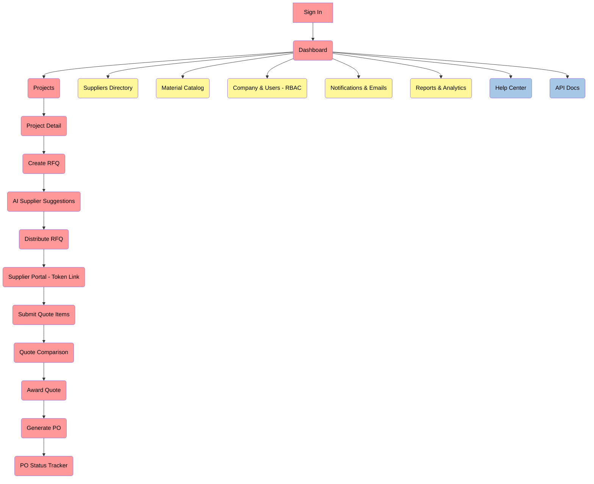
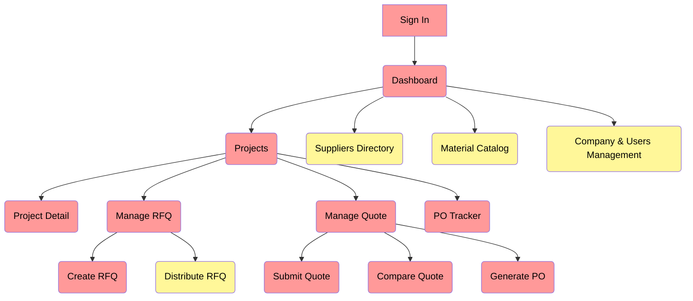

# SoEn1029
軟工課程Version Control, HTML, and CSS

## Assignment #4 – FlowBuilder Website Plan

FlowBuilder 是一個專門為中小型總包商設計的雲端智慧採購平台，目標是解決建築工程中材料採購流程分散、效率低落與風險高的問題。  
系統將傳統透過 email、Excel、電話來回的 RFQ / 報價流程，集中到同一個平台中，並利用 **AI-Assisted RFQ 引擎** 依據工種與歷史績效推薦合適供應商，協助專案準時、在預算內完成。  
下列網站架構是依照 Assignment #1～#3（Business Proposal、Data Model、ETL）文件的章節整理而成，作為之後實作網站的藍圖。

---

### 1. Website Organization (Mermaid Diagram)

---

# FlowBuilder Website Page Map & Tech Overview

## 1) Project Overview

**FlowBuilder** is a smart‑procurement SaaS for construction that replaces fragmented, manual workflows with a centralized, intelligent hub so general contractors can make faster, more cost‑effective decisions. Its core differentiator is an **AI‑assisted RFQ engine** that analyzes project requirements and recommends suppliers based on trade specialty and historical performance.

The platform’s value proposition spans three pillars: a **Centralized Management Hub** (company/users, projects, unified supplier & material databases), an **Intelligent Procurement Module** (AI‑assisted RFQ, quote comparison, one‑click PO), and **Essential Delivery Oversight** (PO status tracking and notifications).

For the **MVP**, FlowBuilder delivers a complete end‑to‑end procurement workflow using one primary persona (Construction Admin), with **pre‑defined suppliers/materials** to reduce setup complexity, while keeping the AI recommendation engine in scope.

---

## 2) Page Map

### Flowchart

### Additional Explanation

- **Create RFQ** embeds **AI Supplier Suggestions** inline (similar to “Get suggestions”), then persists chosen suppliers. Distribution sends the full RFQ package simultaneously to selected suppliers.
- **Submit Quote** is the supplier's submission step results from distribution. Incoming quotes feed a **side‑by‑side comparison** view.
- **Generate PO** converts an awarded quote into a formal **Purchase Order** with one click, carrying line items and totals forward.
- **PO Tracker** manages a simple workflow (Ordered → Confirmed → Shipped → Delivered) and notifies stakeholders on status changes.
- **Phase 2** introduces the **Suppliers Directory** and **Material Catalog** (company‑owned), plus **Company & Users Management** with RBAC—these power richer operations and multi‑tenant scale.

---

## 3) Tech Stack

- Frontend: **HTMX** + **TailwindCSS**
- Backend: **Express (TypeScript)**
- Database: **PostgreSQL**

---

## 4) Team Member

- M11405103 張梓榆 (CEO)
- M11402802 I Putu Krisna Erlangga (CTO)
- M11405507 陳宇任 (CFO)

